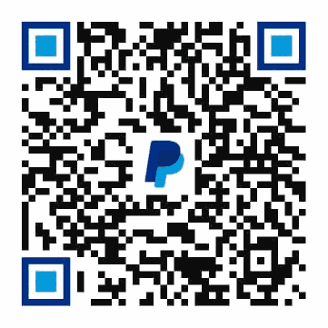
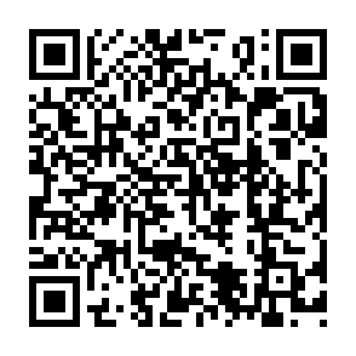

# Support ASense

ASense is free software. Donations are optional and do not unlock features,
guarantee support or change the project's license and warranty terms.

## PayPal

Pay directly to [`paypal.me/fladirm`](https://paypal.me/fladirm) (`@fladirm`).
The PayPal.Me page identifies the recipient before you enter an amount.

## Bitcoin

| Field | Value |
| --- | --- |
| Network | Bitcoin mainnet |
| Address | `bc1qqdumr0umlaak7tyrrh0jx729z272fv2jr4t5zp` |

The address, payment link and QR code all represent the same native Bitcoin
mainnet destination. Send only BTC over the Bitcoin mainnet to this address.
Always compare the complete address shown by your wallet before confirming a
transaction.

The wallet recovery phrase, private keys and extended private keys are never
stored in this repository or included in a release asset.
