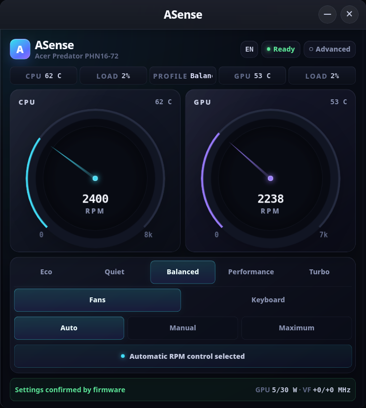
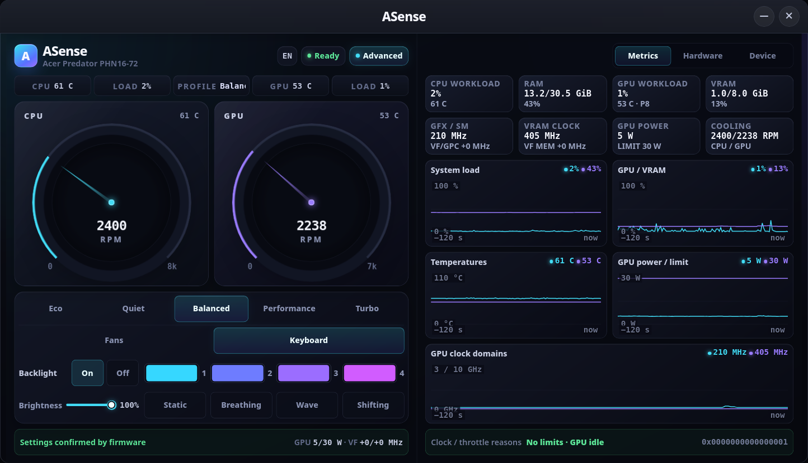

# ASense

A native Linux control panel for Acer Predator, Nitro and related notebooks.
It provides performance profiles, fan control, lighting, selected firmware
options and live telemetry without requiring PredatorSense or NitroSense.

The Predator Helios Neo 16 **PHN16-72** is the reference-tested platform.
ASense v0.2 also discovers compatible Linux, Acer WMI and HID interfaces on
other models and shows only the controls found on the machine.

<!-- markdownlint-disable MD013 MD033 -->
<p align="center">
  
  
</p>
<!-- markdownlint-enable MD013 MD033 -->

## Features

- profile choices from live Linux kernel interfaces, with a known-command Acer
  Gaming-WMI fallback whose writes are verified by readback;
- firmware Auto, manual CPU/GPU and Maximum fan modes through kernel PWM or
  Acer Gaming-WMI;
- temperatures, load and up to eight detected fan RPM channels;
- NVIDIA load, VRAM, clocks, power, P-state and throttle telemetry;
- exact PHN16-72 Turbo GPU offsets with NVML readback and rollback;
- one-to-four-zone WMI lighting;
- ENEK5130 keyboard and cover-logo lighting with runtime-discovered zones and
  effects;
- battery charge limit and firmware calibration;
- USB-off charging, keyboard timeout, boot sound, LCD override and rear-logo
  controls when exposed by firmware;
- compact controls plus advanced graphs and hardware information;
- English and Czech UI.

Missing capabilities are hidden independently: a notebook can have profiles
and RPM without fan writes, or lighting without battery options.

## Supported hardware

<!-- markdownlint-disable MD013 MD033 -->
| Model | Profiles | Fans | Lighting | Platform |
| --- | :---: | :---: | :---: | :---: |
| <code>PHN16&#8209;72</code> | ✅ | ✅ | ✅ | ✅ |
| <code>PH16&#8209;72</code> | 🟢 | 🟢 | 🔎 | 🔎 |
| <code>PT14&#8209;51</code> | 🟢 | 🟢 | 🔎 | 🔎 |
| <code>AN515&#8209;58</code> | 🟢 | 🟢 | 🟡 | 🔎 |
| <code>PHN16&#8209;71</code> | 🟢 | 🟢·🔎 | 🔎 | 🔎 |
| <code>PH16&#8209;71</code> | 🟢 | 🟢·🔎 | 🔎 | 🔎 |
| <code>PH18&#8209;71</code> | 🟢 | 🟢·🔎 | 🔎 | 🔎 |
| <code>PHN14&#8209;51</code> | 🔎 | 🔎 | 🟡 | 🔎 |
| <code>PHN16S&#8209;71</code> | 🔎 | 🔎 | 🟡 | 🔎 |
| <code>PHN16&#8209;73</code> | 🔎 | 🔎 | 🟡 | 🔎 |
| <code>AN16S&#8209;61</code> | 🔎 | 🔎 | 🔎 | 🔎 |
| <code>AN515&#8209;45</code> | 🔎 | 🔎 | 🟡 | 🔎 |
| <code>AN515&#8209;55</code> | 🔎 | 🔎 | 🟡 | 🔎 |
| <code>AN515&#8209;56</code> | 🔎 | 🔎 | 🟡 | 🔎 |
| <code>AN515&#8209;57</code> | 🔎 | 🔎 | 🟡 | 🔎 |
| <code>AN517&#8209;41</code> | 🔎 | 🔎 | 🟡 | 🔎 |
| <code>PH315&#8209;52</code> | 🔎 | 🔎 | 🟡 | 🔎 |
| <code>PH315&#8209;53</code> | 🔎 | 🔎 | 🟡 | 🔎 |
| <code>PH315&#8209;54</code> | 🔎 | 🔎 | 🟡 | 🔎 |
| <code>PH317&#8209;53</code> | 🔎 | 🔎 | 🟡 | 🔎 |
| <code>PH517&#8209;61</code> | 🔎 | 🔎 | 🟡 | 🔎 |
| <code>PT314&#8209;51</code> | 🔎 | 🔎 | 🟡 | 🔎 |
| <code>PT315&#8209;51</code> | 🔎 | 🔎 | 🟡 | 🔎 |
| <code>PT316&#8209;51</code> | 🔎 | 🔎 | 🟡 | 🔎 |
| <code>PT515&#8209;51</code> | 🔎 | 🔎 | 🟡 | 🔎 |
| <code>PT516&#8209;52s</code> | 🔎 | 🔎 | 🟡 | 🔎 |
<!-- markdownlint-enable MD013 MD033 -->

**Legend:** ✅ Reference tested · 🟢 Linux provides it · 🟡 Known Acer
controller/protocol · 🔎 Enabled only when the live probe finds it ·
🟢·🔎 RPM is available, fan control is probed · 🤝 Community confirmed.

PHN16-72 is the full reference platform. PHN14-51 has a known three-zone WMI
layout; PHN16S-71 and PHN16-73 use ENEK5130 lighting. Yellow does not force a
control: it still appears only after the controller answers correctly.

<!-- markdownlint-disable MD033 -->
<details>
<summary><strong>99 model and internal identifiers from the research inventory</strong></summary>
<!-- markdownlint-enable MD033 -->

The following identifiers occur in official Acer Sense packages or public
hardware reports. They are useful machines to test; they are not an all-feature
allow-list.

### Current PredatorSense cohort

```text
PH16-71 PH18-71 PH3D15-71 PHN16-71 PT14-51 PT16-51 PTX17-71
PH16-72 PH18-72 PHN14-51 PHN16-72 PHN18-71 PTN16-51 T7001
PH16-73 PH18-73 PHN14-71 PHN16-73 PHN18-72 PHN16S-71 PT14-52T PTN16-71
```

### Current NitroSense cohort

```text
AN14-41 AN16-41 AN16-42 AN16-43 AN16-51 AN16-61 AN16-72 AN16-73
AN16S-61 AN18-61 AN17-41 AN17-42 AN17-51 AN17-71 AN17-72
ANV14-61 ANV14-62 ANV14-71 ANV15-41 ANV15-42 ANV15-51 ANV15-52
ANV16-41 ANV16-42 ANV16-61 ANV16-71 ANV16-72 ANV16S-61 ANV16S-71
ANV17-41 ANV17-61
```

### Legacy NitroSense cohort

```text
AN515-42 AN515-43 AN515-44 AN515-45 AN515-46 AN515-47 AN515-51s
AN515-52 AN515-53 AN515-54 AN515-55 AN515-56 AN515-57 AN515-58
AN517-41 AN517-42 AN517-43 AN517-51 AN517-52 AN517-53 AN517-54
AN517-55 AN715-41 AN715-51 AN715-52
```

### Additional Predator/Triton candidates

```text
PH315-52 PH315-53 PH315-54 PH315-55 PH317-53 PH317-54 PH517-51
PH517-52 PH517-61 PH717-71 PH717-72 PT314-51 PT315-51 PT314-52s
PT315-52 PT316-51 PT316-51s PT515-51 PT515-52 PT516-52s PT917-71
```

Battery/APGE discovery can also help non-gaming Acers. Public working reports
include `A315-24PT`, `A315-44P`, `A315-59`, `A315-510P`, `A515-45`,
`A515-46-R14K`, `A715-42G`, `AG15-42P`, `AV15-53P`, `EUN314A-51W`,
`AN515-44`, `AN515-57`, `AN515-58`, `AN517-54`, `ANV15-51`, `AN16-43-R7N7`,
`ANV16-42`, `PHN16-71`, `SF314-34`, `SF314-43`, `SFE16-44-R48X`,
`SFG14-63-R6PU`, `SFG16-72`, `SFX14-71G` and `SFX16-61G`.

<!-- markdownlint-disable MD033 -->
</details>
<!-- markdownlint-enable MD033 -->

The model names above do not control discovery. The live backend order is:

```text
profiles: kernel platform_profile -> Acer Gaming-WMI -> unavailable
fans:     kernel PWM -> Acer Gaming-WMI -> RPM only
lighting: zoned WMI or a detected ENEK5130 target
```

Kernel-backed profile choices come from the live kernel `choices` interface.
The Gaming-WMI fallback instead exposes the driver's bounded set of known
commands; it is not a firmware-enumerated list. The probe makes this distinction
explicit as `profiles.choices_source = kernel-live` or
`known-gaming-wmi-commands`.

The battery 80% health limit is a firmware setting, not a Linux charge
threshold file. Enabling it while the battery is already above 80% does not
actively discharge the battery; the effect becomes visible after normal use,
when firmware prevents a subsequent charge from exceeding the limit.

## Install

### Ubuntu PPA (recommended)

On Ubuntu 26.04, install ASense and receive updates through APT:

```bash
sudo add-apt-repository ppa:fladirmacht/asense
sudo apt update
sudo apt install asense
```

APT installs the application, privileged daemon, DKMS transport and desktop
integration together. Rust is not required. Remove the package with
`sudo apt remove asense`, or remove its ASense-owned configuration and state as
well with `sudo apt purge asense`.

### Standalone release

The recommended release asset is the
[`ubuntu-26.04-x86_64-installer` ZIP](https://github.com/fladirm/asense/releases/latest).
It contains prebuilt `asense` and `asensed` binaries, so Rust is not required.
Ubuntu 26.04 x86_64 is the supported prebuilt baseline.

Install runtime and optional DKMS prerequisites:

```bash
sudo apt update
sudo apt install \
  build-essential dkms "linux-headers-$(uname -r)" kmod udev util-linux \
  python3 unzip mokutil desktop-file-utils \
  libgtk-3-0t64 libwebkit2gtk-4.1-0 libxdo3 libssl3t64
```

Download the installer ZIP and matching `.zip.sha256` from the Release page,
then verify and install it as the logged-in desktop user (not with `sudo`):

```bash
sha256sum --check asense-v0.2.2-ubuntu-26.04-x86_64-installer-*.zip.sha256
unzip asense-v0.2.2-ubuntu-26.04-x86_64-installer-*.zip
cd asense-v0.2.2-ubuntu-26.04-x86_64-installer-*/
./install.sh
```

The installer requests elevation only for system files, builds the optional
DKMS transport when needed, configures the daemon/socket and verifies the
installation. Re-running a newer installer upgrades in place.

Standalone releases can be reinstalled or upgraded in place. A Debian package
can likewise be reinstalled or upgraded through APT and safely takes ownership
of an older standalone installation. To avoid mixed ownership, the standalone
installer and uninstaller refuse to modify an installation currently managed
by dpkg. Run `sudo apt purge asense` before switching from the Debian package
back to a standalone release; a plain `apt remove` deliberately leaves package
state whose later purge could otherwise affect the standalone installation.

Launch ASense from the application menu or run:

```bash
asense
```

Create a local read-only report for a GitHub issue with:

```bash
asense probe > asense-probe.json
```

Close the ASense window first so the one-shot probe can use the daemon's
single control session.

The report contains model, profile, fan, known WMI and known HID capability
data. It sends only `HELLO` and `CAPS` to the local daemon so typed ENEK5130
zones and modes can be included when available; it sends no setter and falls
back to passive HID inspection when the daemon is unavailable. It omits serial
numbers, UUID, hostname, user and network identifiers, journals and raw ACPI
tables. Review it before sharing.

Uninstall with the copy retained by the installer:

```bash
/usr/libexec/asense/uninstall.sh
```

Uninstall returns an active fan session to Auto, removes ASense services,
DKMS/HWDB/udev integration and the desktop entry. Other firmware settings
(profile, lighting, charge limit and similar choices) remain configured.

### Secure Boot

DKMS uses the distribution signing setup. If module loading reports
`Key was rejected by service`, import the key path printed by DKMS (commonly
`/var/lib/shim-signed/mok/MOK.der`) and complete MOK enrollment after reboot:

```bash
sudo mokutil --import /var/lib/shim-signed/mok/MOK.der
```

## Build from source

Install build dependencies:

```bash
sudo apt update
sudo apt install \
  build-essential pkg-config git dkms "linux-headers-$(uname -r)" libelf-dev \
  libgtk-3-dev libwebkit2gtk-4.1-dev libxdo-dev libssl-dev \
  desktop-file-utils python3 mokutil udev
```

Install Rust with `rustup`, then run:

```bash
cargo test --locked
cargo build --release --locked --bin asensed --no-default-features
cargo build --release --locked --bin asense --features gui
./install.sh
```

## Control behaviour

- profile and WMI settings are read back after writing;
- failed multi-step fan/profile changes use the existing rollback path;
- Manual fan mode is tied to the GUI session and returns to Auto after a
  disconnect;
- a confirmed Maximum request remains active after the GUI closes; daemon
  restart and resume reconciliation return firmware control to Auto;
- HID lighting without a getter shows `State unknown` after discovery and
  `Last applied` after a successful write;
- battery calibration shows only real firmware state and live battery/AC
  telemetry. Keep the AC adapter connected during calibration;
- NVIDIA offsets and the Predator hardware-key mapping remain exact
  PHN16-72 features.

The GUI is unprivileged. Hardware writes run through the root-owned,
socket-activated `asensed` helper. ASense exposes typed profile, fan, lighting
and platform operations; it does not expose a raw WMI/ACPI/EC/HID console.

## Local API

The installed desktop user owns the `0600` Unix socket
`/run/asense-control.sock`. Every UTF-8 command is newline-terminated; the
first command must be `HELLO 2`:

```bash
python3 - <<'PY'
import socket

s = socket.socket(socket.AF_UNIX, socket.SOCK_STREAM)
s.connect("/run/asense-control.sock")
f = s.makefile("rwb", buffering=0)
for command in (b"HELLO 2\n", b"CAPS\n"):
    f.write(command)
    print(f.readline(4097).decode().rstrip())
PY
```

The expected replies begin with `OK protocol=2` and `OK caps=1`; the latter is
followed by capability JSON. Every reply is `OK <payload>` or `ERR <message>`.

<!-- markdownlint-disable MD013 -->
| Operation | Command |
| --- | --- |
| Discover | `PING`, `CAPS`, `HARDWARE GET`, `PLATFORM GET` |
| Profile | `PROFILE <raw-token-from-CAPS>` |
| Fans | `FAN AUTO`, `FAN MAXIMUM`, `FAN MANUAL <cpu-20..100> <gpu-20..100>` |
| Lighting | `LIGHTING APPLY <device-id> <OFF\|STATIC\|BREATHING\|NEON> <brightness-0..100> <speed-0..9> <RRGGBB> <-\|RRGGBB,...>`, `LIGHTING POWER <device-id> <ON\|OFF>` |
| Platform toggles | `PLATFORM <BATTERY_LIMIT\|KEYBOARD_TIMEOUT\|BOOT_SOUND\|LCD_OVERRIDE> <ON\|OFF>` |
| Other platform controls | `PLATFORM BATTERY_CALIBRATION <START\|STOP>`, `PLATFORM USB_CHARGING <0\|10\|20\|30>`, `PLATFORM REAR_LOGO <RRGGBB> <brightness-0..100> <ON\|OFF>` |
<!-- markdownlint-enable MD013 -->

Commands are limited to 192 bytes excluding the newline; response content is
limited to 4096 bytes. A normal `ERR` rejects only that command and leaves the
session usable. There is no generic raw-call command or required client
library.

## Development and releases

Release packaging, checksums, CI gates and reproducibility are documented in
[`docs/RELEASING.md`](docs/RELEASING.md). Kernel-backed support follows the
upstream Linux
[`acer-wmi`](https://github.com/torvalds/linux/blob/master/drivers/platform/x86/acer-wmi.c)
driver.

## Donate

If ASense is useful to you, donations are optional:

- **PayPal:** [`paypal.me/fladirm`](https://paypal.me/fladirm) (`@fladirm`)
- **Bitcoin:** [`bc1qqdumr0umlaak7tyrrh0jx729z272fv2jr4t5zp`](bitcoin:bc1qqdumr0umlaak7tyrrh0jx729z272fv2jr4t5zp)

See [`DONATE.md`](DONATE.md) for the PayPal and Bitcoin QR codes.

## Author and license

**Fladirmacht** — <fladirmacht@gmail.com>

ASense is provided **AS IS** and is licensed **GPL-2.0-only**. See
[`LICENSE`](LICENSE). ENEK5130 wire-protocol research was independently
documented by
[`predator-sense`](https://github.com/cleyton1986/predator-sense); ASense uses
its own implementation and tests.
